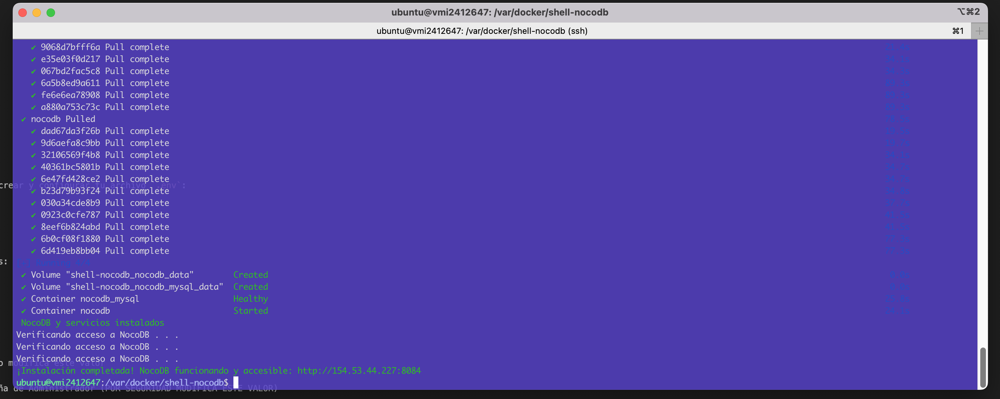
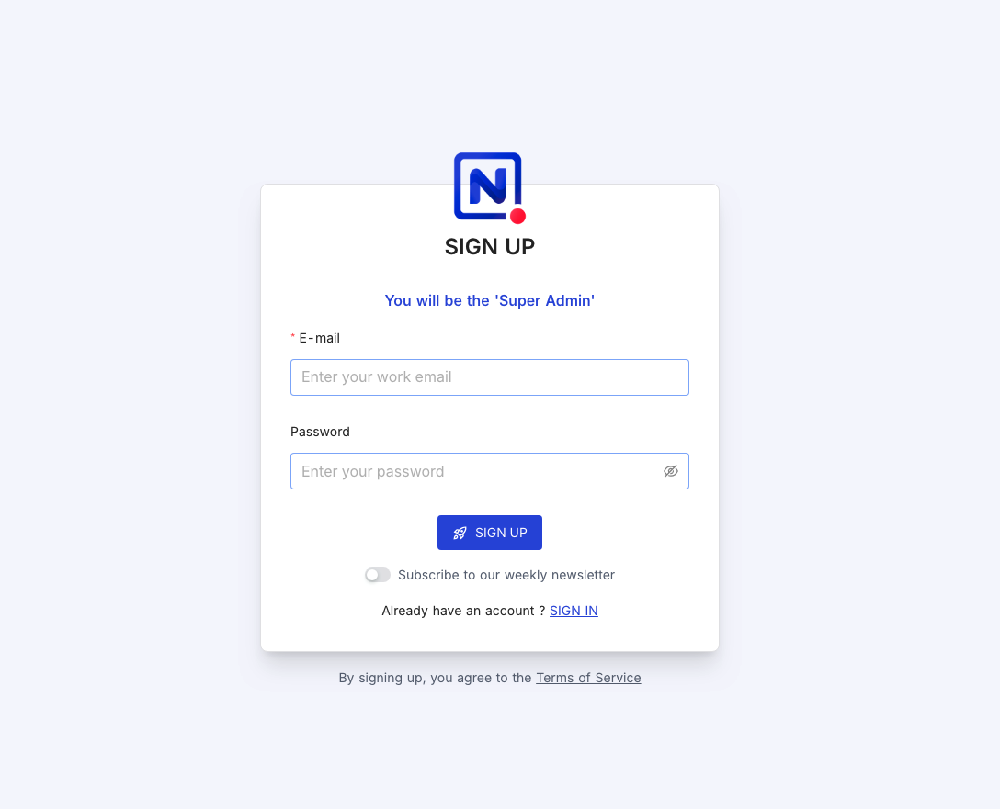

# Instalación Automática de Docker, Docker Compose y NocoDB

Este repositorio proporciona un script Bash (`install.sh`) para instalar y configurar Docker, Docker Compose plugin y NocoDB en servidores basados en Ubuntu.

## Requisitos previos

- Sistema operativo: Ubuntu 18.04, 20.04, 22.04, 24.04 (u otra versión compatible con los repositorios oficiales de Docker)
- Acceso con usuario que tenga privilegios de sudo
- Conexión a Internet desde el servidor

## Contenido del repositorio

```plaintext
/shell-nocodb
├── install.sh              # Script que automatiza la instalación.
├── docker-compose.yml      # Definición del servicio para Docker Compose
├── .env.example            # Ejemplo de variables de entorno
├── .gitignore              # Archivos y carpetas ignorados por Git
├── README.md               # Documentación del proyecto
```

### 1. Descargar o clonar el repositorio

```bash
git clone https://github.com/devalexcode/shell-nocodb.git
```

### 2. Ingresa a la carpeta del proyecto

```bash
cd shell-nocodb
```

### 3. Crea el archivo `.env`

```bash
cp .env.example .env
```

**3.1 ⚙️ Configuración del archivo `.env`**

Antes de levantar los servicios, asegúrate de crear y configurar tu archivo `.env`:

```bash
nano .env
```

Edita el archivo `.env` con tus propios valores:

```dotenv
############################################
# NocoDB
############################################

# ------------------------------------------
NOCODB_PORT=8080 # Si tienes este puerto en uso modifica este valor
# ------------------------------------------
NC_AUTH_JWT_SECRET=jwt_super_seguro # Contraseña de Administrador (POR SEGURIDAD MODIFICA ESTE VALOR)
# ------------------------------------------

############################################
# MySQL
############################################

# ------------------------------------------
MYSQL_ROOT_PASSWORD=MySQL_root_pass # MySQL root password (POR SEGURIDAD MODIFICA ESTE VALOR)
# ------------------------------------------
MYSQL_NOCODB_USER_PASSWORD=MySQL_NocoDB_pass # MySQL NocoDB password (POR SEGURIDAD MODIFICA ESTE VALOR)
# ------------------------------------------

```

### 4. Dar permisos de ejecución al script

```bash
chmod +x install.sh
```

### 5 Ejecutar el script

```bash
./install.sh
```

- El script actualizará el sistema, instalará Docker y sus herramientas, añadirá el usuario al grupo `docker` y desplegará NocoDB.



## Ingresar a NocoDB

Al finalizar, verás un mensaje indicando la URL de acceso a NocoDB:

```bash
¡Instalación completada! NocoDB funcionando y accesible: http://<IP_DEL_SERVIDOR>:NOCODB_PORT
```



## 👨‍💻 Autor

Desarrollado por [Alejandro Robles | Devalex ](http://devalexcode.com)  
¿Necesitas que lo haga por ti? ¡Estoy para apoyarte! 🤝 https://devalexcode.com/soluciones/instalacion-de-nocodb-en-servidor-vps

¿Dudas o sugerencias? ¡Contribuciones bienvenidas!
